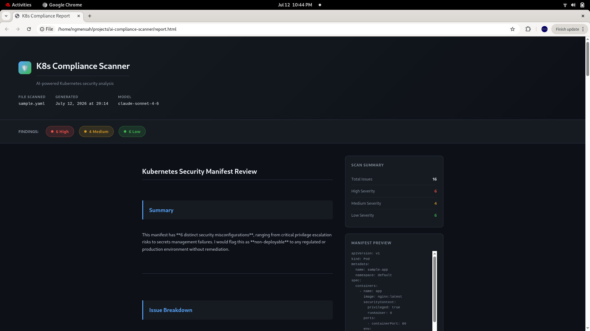

# K8s Compliance Scanner

An AI-powered security tool that analyzes Kubernetes manifests 
for misconfigurations and generates compliance reports mapped 
to real security frameworks.

## What it does

- Scans Kubernetes YAML manifests for security issues
- Rates each finding by severity: HIGH, MEDIUM, or LOW
- Maps findings to compliance frameworks including NIST, 
  CIS Kubernetes Benchmark, PCI DSS, and SOC 2
- Generates a professional HTML report with remediation guidance

## Why I built this

I spent 8 years as an ISSO ensuring systems had their ATO 
before moving into DevOps work. I built this tool to bridge 
the gap between compliance requirements and real infrastructure 
— using AI to make security reviews faster and more accessible.

## Tech stack

- Python 3
- Anthropic Claude API
- YAML parsing

## Setup

1. Clone the repo
2. Create a virtual environment: `python3 -m venv venv`
3. Activate it: `source venv/bin/activate`
4. Install dependencies: `pip install anthropic python-dotenv`
5. Create a `.env` file with your API key: 
   `ANTHROPIC_API_KEY=your-key-here`
6. Run: `python3 scanner.py`

## Output

The scanner generates two files:
- `report.txt` — plain text findings
- `report.html` — professional report with severity 
   badges and framework mappings

## Example

